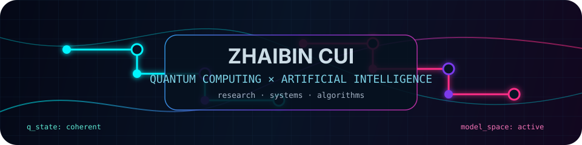

<div align="center">



<h1>Zhaibin Cui</h1>

<p>
  <strong>Quantum Computing · Artificial Intelligence · Computational Systems</strong>
</p>

<p>
  
  
  
</p>

<picture>
  <source media="(prefers-color-scheme: dark)" srcset="https://raw.githubusercontent.com/Zhaibin-Cui/Zhaibin-Cui/output/pacman-contribution-graph-dark.svg">
  <source media="(prefers-color-scheme: light)" srcset="https://raw.githubusercontent.com/Zhaibin-Cui/Zhaibin-Cui/output/pacman-contribution-graph.svg">
  
</picture>

<sub>Contribution graph rendered as an arcade-style activity layer. Updated automatically.</sub>

</div>

---

### Focus

- Quantum computing and quantum information workflows
- Artificial intelligence, model behavior, and applied ML systems
- Computational tooling for research, experimentation, and reproducibility
- Practical software systems that connect theory with usable implementations

### Technical direction

I work around the boundary between quantum methods and AI systems, with an emphasis on clear abstractions, reliable experiments, and implementation quality.

```txt
quantum_state  →  measurement  →  data
data           →  model        →  inference
inference      →  system       →  feedback
```
