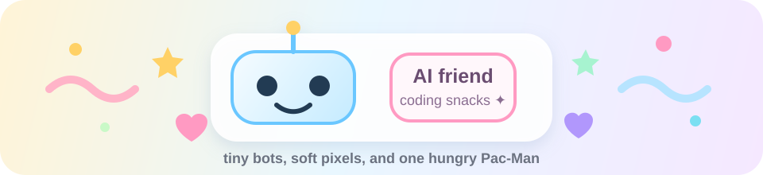

<div align="center">



<h1>Hi, I'm Zhaibin Cui 👾</h1>

<p>
  <em>Building little things with AI, code, and curiosity.</em>
</p>

<p>
  
  
  
</p>

<picture>
  <source media="(prefers-color-scheme: dark)" srcset="https://raw.githubusercontent.com/Zhaibin-Cui/Zhaibin-Cui/output/pacman-contribution-graph-dark.svg">
  <source media="(prefers-color-scheme: light)" srcset="https://raw.githubusercontent.com/Zhaibin-Cui/Zhaibin-Cui/output/pacman-contribution-graph.svg">
  
</picture>

<sub>Pac-Man refreshes automatically. The original GitHub contribution calendar still exists below GitHub's own profile sections.</sub>

</div>

---

### 🌱 Current vibe

- 🤖 Exploring AI-assisted development
- 🎮 Making my GitHub garden look less serious
- 🍒 Feeding Pac-Man with contribution dots
- ✨ Keeping projects small, readable, and fun

### 🧸 Tiny AI corner

```txt
   /\_/\
  ( o.o )   beep boop, ship cute things
   > ^ <
```

