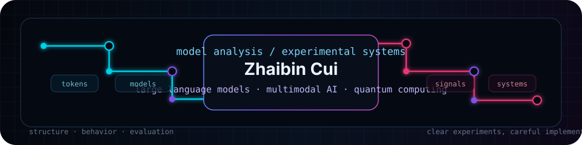

<div align="center">



<h1>Zhaibin Cui</h1>

<p>
  <strong>Large Language Models · Multimodal AI · Quantum Computing</strong>
</p>

<p>
  I study how large language models are organized, how their behavior emerges in practice,
  and how experiments can turn opaque behavior into testable explanations.
</p>

<p>
  
  
  
</p>

<!-- Replace these with exact personal profile URLs when available.
<p>
  <a href="YOUR_GOOGLE_SCHOLAR_URL">Google Scholar</a> ·
  <a href="YOUR_ORCID_URL">ORCID</a>
</p>
-->

<picture>
  <source media="(prefers-color-scheme: dark)" srcset="https://raw.githubusercontent.com/Zhaibin-Cui/Zhaibin-Cui/output/pacman-contribution-graph-dark.svg">
  <source media="(prefers-color-scheme: light)" srcset="https://raw.githubusercontent.com/Zhaibin-Cui/Zhaibin-Cui/output/pacman-contribution-graph.svg">
  
</picture>


</div>

---

### Current focus

| Area | What I care about |
| --- | --- |
| Large language models | structure, behavior, evaluation, and failure analysis |
| Multimodal AI | previous work on vision-language model systems |
| Quantum computing | experimental workflows and implementation-level practice |

### Background

- Previously worked on vision-language models.
- Previously worked on quantum computing experiments.
- Currently focused on understanding large language models through implementation, measurement, and analysis.

### Working style

I prefer concrete experiments, readable code, and technical claims that can be checked directly.

```txt
question → experiment → observation → explanation → revision
```
